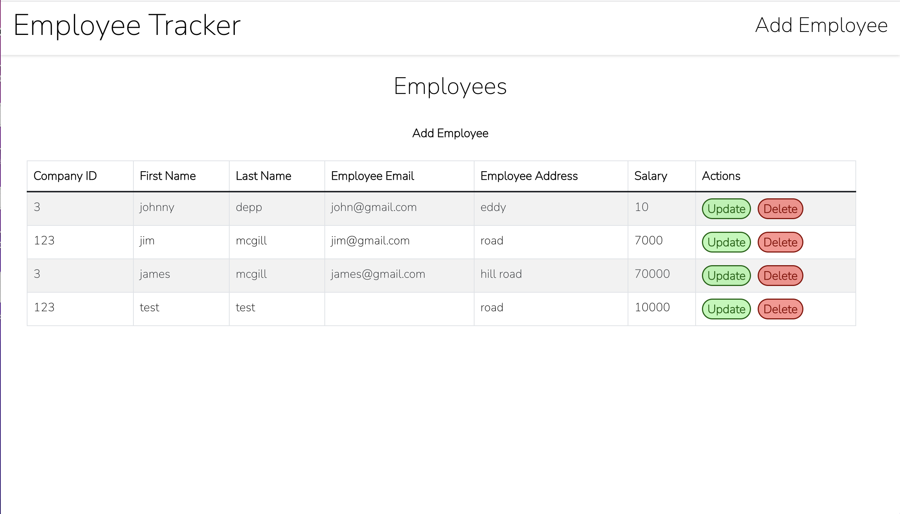

# employeeTracker
  
  

  

  ## Description
  This project was to create a fullstack application that followed all of the CRUD methods: CREATE, UPDATE, DELETE, READ employyes using java for the backend, MySQL for the database, and react.js for the frontend. I initiated the project using the spring-boot framework, that allowed me to easily configure and set up the application. JPA was also used to help manage the relational data in this application. The Backend code was written in IntelliJ DEA (EmployeeTracker folder) and the frontend code was written in VSCode (employee-tracker-frontend folder).

  ## Installation
  To install: clone this repository  -> cd employee-tracker-frontend -> run command "npm install"
  
  
  ## Start frontend
  cd employee-tracker-frontend  -> npm start
  it will be running on localhost:3000

 ## Start backend
 navigate to EmployeeTracker/src/main/java/EmployeeTrackerApplication.java and click run.
 it will be running on localhost:8080

  

